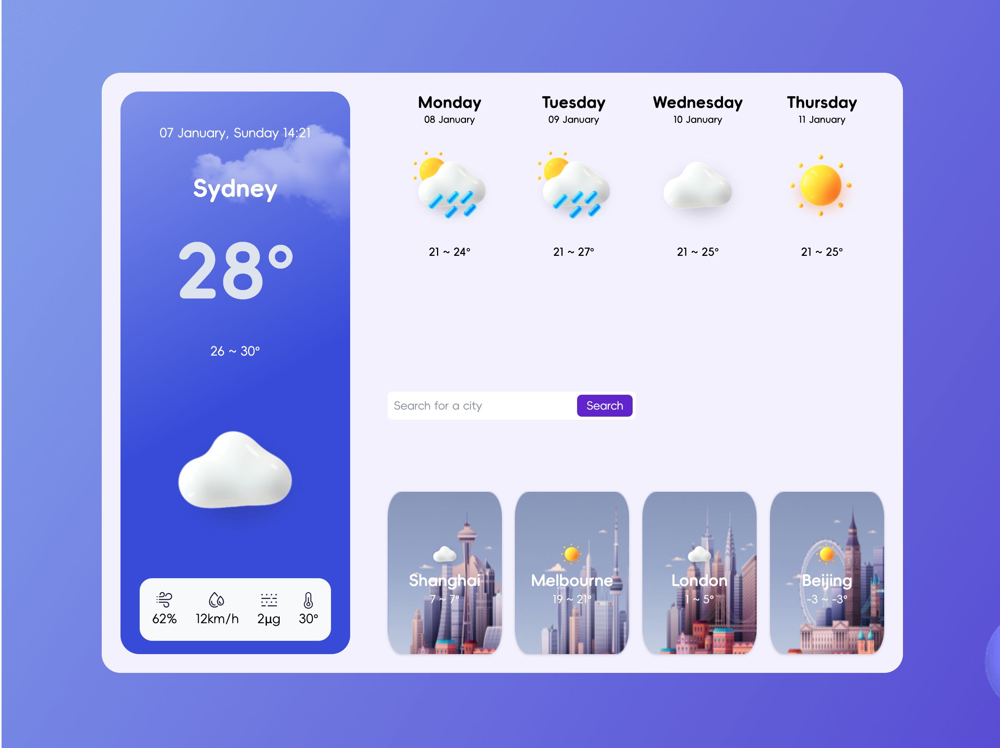
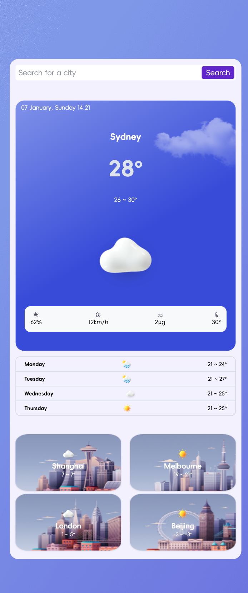
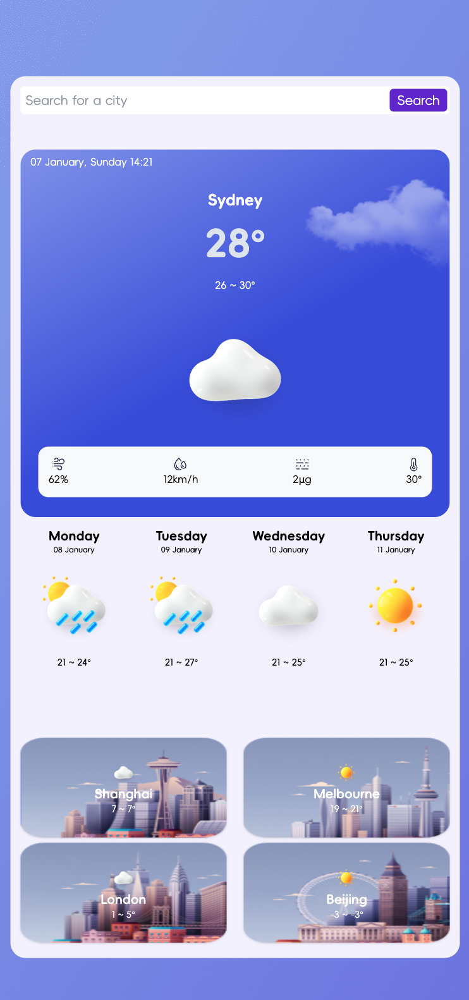

# weather-app

## Description

This is a weather app that allows the user to search for a city and get the current weather and a 4 day forecast. The user can also click on a city in the search history to get the weather for that city again.

## UI Design

[Live Demo](https://winnieweatherappreact.netlify.app)

## Technologies Used

- React(useEffect, useState, props)
- Tailwind CSS
- Weather API (https://openweathermap.org/)

## How to start?

In the project directory, you can run:

### `cd client`

### `npm start`

Runs the app in the development mode.\
Open [http://localhost:3000](http://localhost:3000) to view it in your browser.
